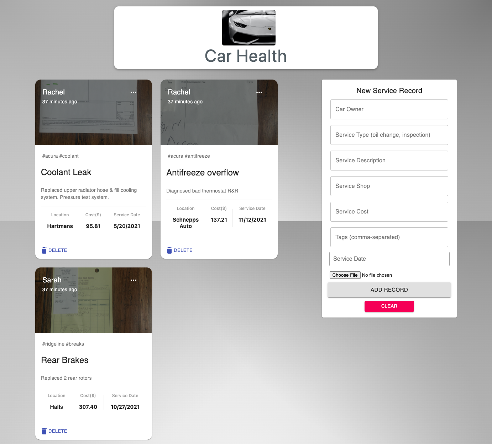

# Car Health 

You can view the app [here](https://car-health.netlify.app/).

Car Health is a car maintenance tracking app to keep accurate records for your car's service history. I've learned that it isn't easy to keep track of frequent service visits, with everything from oil changes to coolant flushes and new batteries, especially when you're not exactly a car person. That's why I created this service tracking app, so I never forget an inspection again!

## Tech Stack

MongoDB, ExpressJS, React/Redux, NodeJS, Mongoose, Nodemon, Material UI
